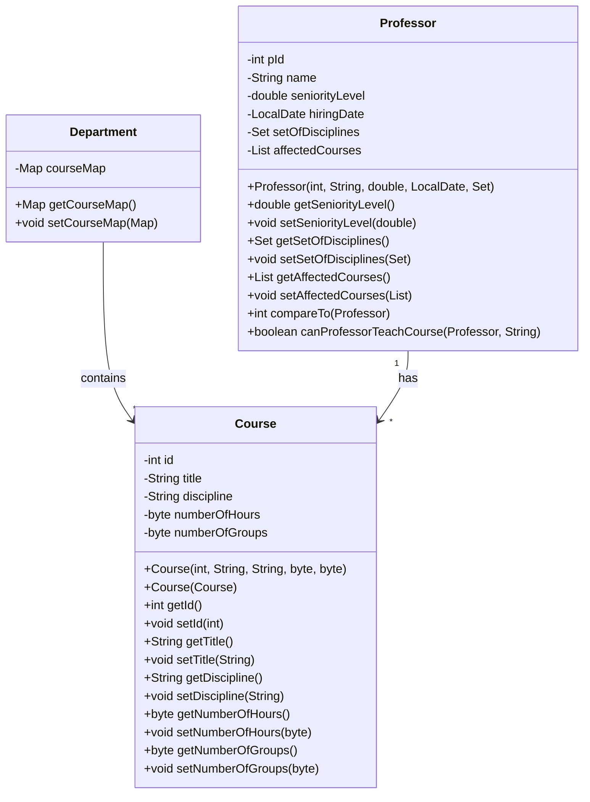

# Project: Generic Priority Queue and Course Allocation Algorithm

## Part 1 - Implementing a Generic Priority Queue

A queue is an abstract data type where elements are enqueued at the rear and dequeued from the front. Below is a breakdown of the queue functionality implemented in the project:

| **Method**                | **Description**                                                                                      |
|---------------------------|------------------------------------------------------------------------------------------------------|
| `Queue()`                 | Constructor, creates an array of length 20                                                           |
| `Queue(List<E>)`          | Constructor, creates a queue from a list of objects, size of the queue is 2x the number of elements   |
| `bool isEmpty()`          | Returns `true` if the queue is empty, `false` otherwise                                               |
| `bool isFull()`           | Returns `true` if the queue is full, `false` otherwise                                                |
| `void enqueue(T)`         | Inserts an element of type `T` at the rear of the queue                                               |
| `T dequeue()`             | Removes the element at the front of the queue                                                         |
| `int getSize()`           | Returns the number of elements in the queue                                                           |
| `void resize()`           | Resizes the queue when it’s full                                                                      |
| `void displayAllElements()`| Prints all elements in the queue starting from the front                                              |

The queue was further modified into a **priority queue** by inheriting from the basic queue and overriding the `enqueue()` method.

| **Method**                | **Description**                                                                                      |
|---------------------------|------------------------------------------------------------------------------------------------------|
| `void enqueue(T)`         | Enqueue an object at the appropriate index based on its priority                                      |
| `void displayElement(T)`  | Search for and print the element if found                                                             |
| `void displayHigherElements(T)`| Display all elements with higher priority than the given object                                   |
| `void displayLowerElements(T)`| Display all elements with lower priority than the given object                                    |

---

## Project Description

In this project, we implemented a professor class that adheres to the `Comparable` interface by overriding the `compareTo()` method. The comparison is based on seniority, where the professor with more seniority is considered higher. In cases where two professors have the same seniority, their date of hire serves as the tiebreaker, with the one hired earlier being deemed more senior. Upon construction, the `ArrayList<Course> listOfAffectedCourses` is initialized as null.

The department class manages a collection of courses and professors through two primary data structures: a `courseMap<courseId, Course>`, and an `ArrayList<Professor> listOfProfs`. A partially parameterized constructor allows for the creation of a department by accepting a `listOfProfs` and constructing a new `HashMap<String, Course>` for managing the courses.

Part of the project also involves implementing a shallow matching algorithm to allocate courses to professors, taking into account the professor's discipline, course availability, and weekly hours preference. La Salle College, where this algorithm is implemented, has multiple departments with various programs, such as Programming, Networking, Gaming, Mobile, Business Intelligence, and Artificial Intelligence. Each program has its own set of courses, which are categorized under different disciplines.

Professors submit their teaching preferences before the start of each semester, specifying how many hours they wish to teach per week (up to a maximum of 30 hours) and the courses they are interested in teaching, along with the number of groups they want to handle per course.

The matching algorithm utilizes a priority queue that is populated based on professor seniority. Course requests are processed from a professor’s file (profId_select.txt), and course availability is checked against a course catalog (courses_f22.txt). Courses are assigned to professors if there is a match in discipline and the requested number of groups is available. The algorithm continues assigning courses until the professor’s requested weekly hours are fulfilled.

The assignment process includes updating the number of groups available for each course in the `courseMap` and adding the course to the professor's `listOfAffectedCourses`. Additionally, helper methods, such as `getWeeklyHours()`, are used to calculate weekly teaching hours based on the total course duration.

This system effectively automates course allocations while considering constraints such as professor availability, disciplines, and course demand.

---

For additional resources on Java documentation and archive creation, refer to:

- [Java Doc Documentation](http://www.drjava.org/docs/user/ch10.html#javadoc-writing)
- [Java Archive Documentation](https://docs.oracle.com/javase/tutorial/deployment/jar/build.xml)

# Java Project Title

This is a Java project that includes classes for managing a department in a university. The main classes are `Professor` and `Course`.

## Installation

1. Clone the repository: `git clone https://github.com/analariosmed/your-repo.git`
2. Navigate to the project directory: `cd your-repo`
3. Compile the project: `javac src/java/com/lasalle/Main.java`

## Usage

Run the project using the command: `java src/java/com/lasalle/Main`

## Class diagram 

