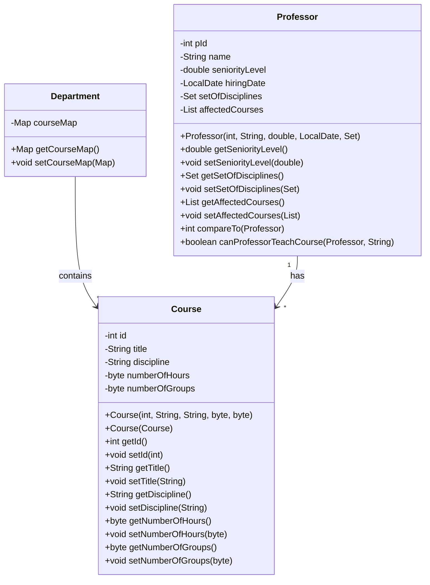

# Java Project Title

This is a Java project that includes classes for managing a department in a university. The main classes are `Professor` and `Course`.

## Installation

1. Clone the repository: `git clone https://github.com/analariosmed/your-repo.git`
2. Navigate to the project directory: `cd your-repo`
3. Compile the project: `javac src/java/com/lasalle/Main.java`

## Usage

Run the project using the command: `java src/java/com/lasalle/Main`

## Class diagram 

